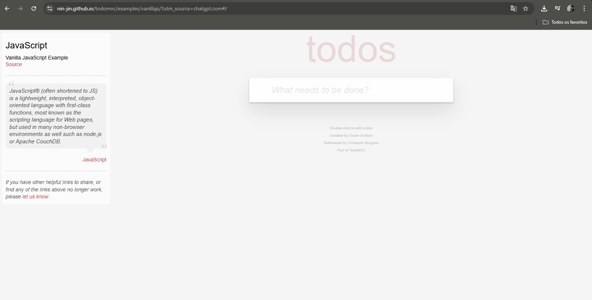
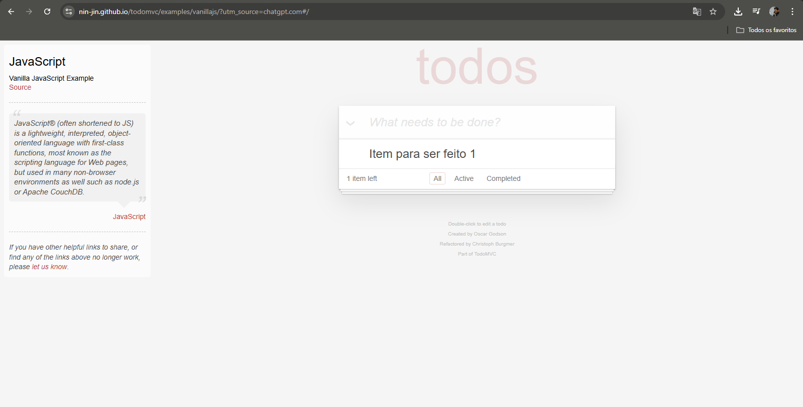
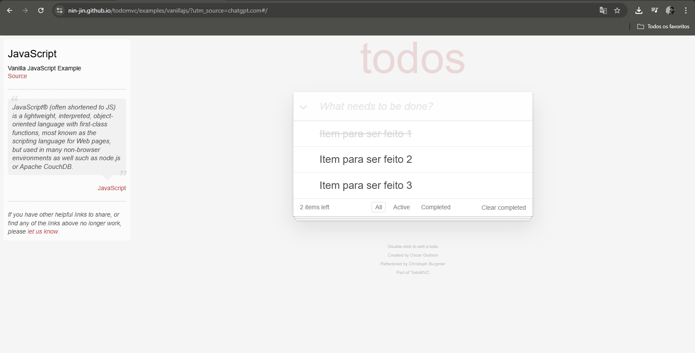
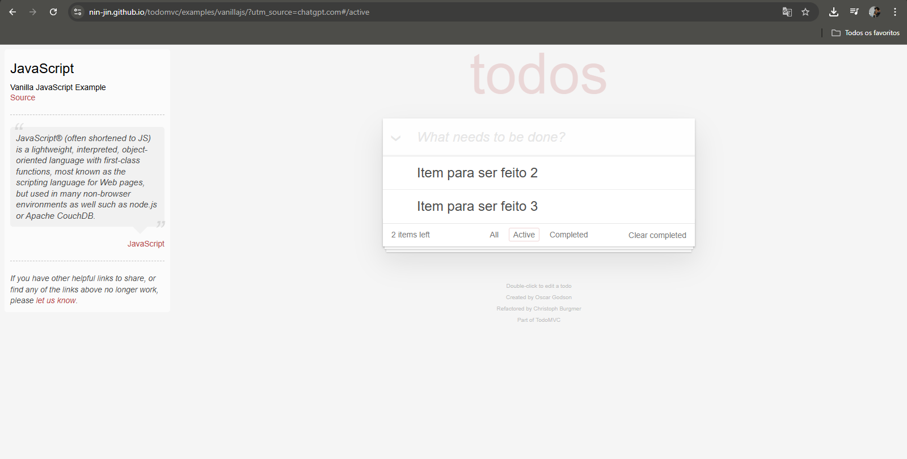
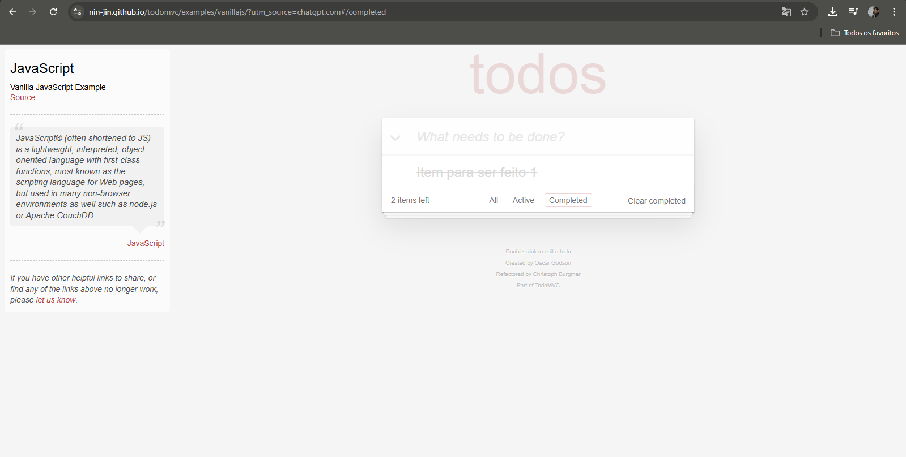

# Projeto de QA: Planejamento e Estratégia - App To-Do

Este repositório documenta o ciclo de garantia de qualidade para uma aplicação de lista de tarefas (To-Do List). O projeto abrange desde o levantamento de requisitos via Storyboard até a definição da estratégia de testes e escrita de casos de teste.

---

## 🖼️ 1. Storyboard e User Stories
Abaixo, a jornada do usuário mapeada no Miro, detalhando as funcionalidades principais.

### Tela Inicial e Adição

* **User Story:** Como usuário, gostaria de possuir um campo para adicionar minha tarefa.
* **Critério de Aceite (CA1):** O campo deve possuir a label "O que precisa ser feito?".

### Ações e Listagem

* **Regra de Negócio (RN1):** Ao adicionar o primeiro item, deve ser exibido o rodapé com os filtros.
* **RN2:** Cada item deve possuir um radio button para conclusão e um botão para exclusão.

### Validação de Filtros

---

## 🚀 2. Estratégia e Tipos de Teste
Para este projeto, foram definidos os seguintes níveis de cobertura:

* **Testes Funcionais:** Validar se as funcionalidades (adicionar, filtrar e concluir) operam conforme o esperado.
* **Testes de Interface (UI):** Verificar o layout e posicionamento dos elementos baseados no Storyboard.
* **Testes de Usabilidade:** Garantir que a experiência do usuário seja fluida e intuitiva.
* **Testes de Regressão:** Validar se novas inclusões não impactam o funcionamento dos filtros e do contador.
* **Testes de Responsividade:** Garantir o funcionamento correto em dispositivos mobile e desktop.

---

## 📝 3. Casos de Teste (CT)

| ID | Cenário | Passo a Passo | Resultado Esperado |
| :--- | :--- | :--- | :--- |
| **CT01** | Adição de tarefa | 1. Digitar tarefa no input 2. Pressionar Enter | Tarefa aparece na lista e o contador é atualizado para "1 item left". |
| **CT02** | Filtro 'Ativos' | 1. Adicionar 2 tarefas 2. Concluir 1 tarefa 3. Clicar em 'Ativos' | Apenas a tarefa não concluída deve ser exibida na lista. |
| **CT03** | Filtro 'Concluídos' | 1. Adicionar 1 tarefa 2. Marcar como concluída 3. Clicar em 'Completed' | A tarefa marcada deve aparecer com estilo "riscado" (strikethrough). |
| **CT04** | Exclusão de item | 1. Adicionar uma tarefa 2. Clicar no 'X' lateral | O item deve ser removido da lista e o contador deve sumir se for o último item. |

---

## 🛠️ Tecnologias Utilizadas
* **Miro:** Storyboarding e mapeamento de requisitos.
* **GitHub:** Versionamento da documentação e portfólio.
* **Markdown:** Formatação da documentação técnica.

---
**Dica de QA:** Este projeto demonstra a mentalidade *Shift-Left*, onde a qualidade é pensada antes mesmo do início do desenvolvimento do código.
